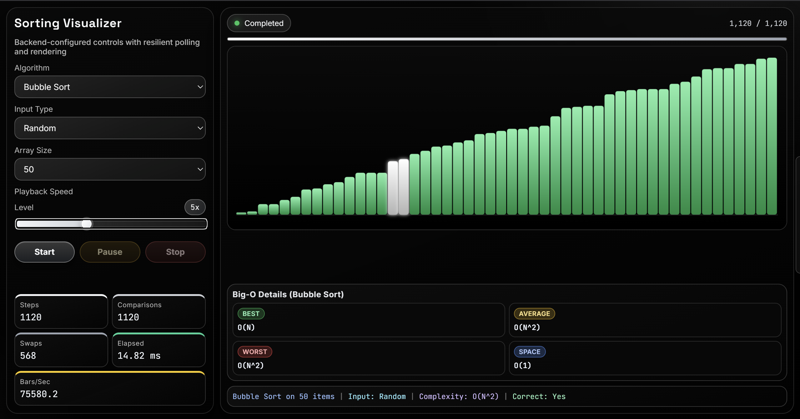

# Sorting Visualizer Web App



Robust web-based sorting visualizer built with:

- Flask backend (Python 3.10+)
- TypeScript + Vite frontend (Node.js 18+)

The backend executes sorting runs in daemon worker threads and streams steps through polling APIs.
The frontend renders these steps on an HTML canvas with a guarded state machine.

## Current Features

- Supported algorithms: Bubble Sort, Selection Sort, Insertion Sort, Merge Sort, Quick Sort, Heap Sort
- Supported input types: Random, Nearly Sorted, Reversed, Few Unique
- Array size options: 20, 30, 40, 50
- Playback speed: 1x to 12x
- Speed can be changed while a run is active
- Big-O complexity panel under the graph
- Immediate Stop behavior in UI (local finalize + best-effort backend cancel)
- HiDPI canvas rendering with resize observer support

## Project Structure

```
main.py
requirements.txt
README.md
backend/
  app.py
  run_manager.py
  api/
    routes.py
  sorting/
    complexity.py
    array_generator.py
    algorithms/
      base.py
      bubble_sort.py
      selection_sort.py
      insertion_sort.py
      merge_sort.py
      quick_sort.py
      heap_sort.py
frontend/
  package.json
  vite.config.ts
  tsconfig.json
  src/
    main.ts
    types.ts
    config.ts
    styles.css
```

## Backend Architecture

- Application factory: `create_app(config: dict | None = None)` in `backend/app.py`
- Shared run registry uses a single module-level lock in `backend/run_manager.py`
- Run lifecycle safeguards:
  - Step buffer cap: 10,000 entries per run
  - Hard timeout: 60 seconds per run
  - Reaper thread removes terminal runs older than 5 minutes
- Worker threads are daemon threads
- Deterministic array generation seeded by run ID
- Final correctness check validates `final_array == sorted(final_array)`

## Frontend Architecture

- State machine statuses:
  - `idle`, `starting`, `running`, `paused`, `cancelling`, `completed`, `failed`
- Polling engine:
  - Interval tick every 16ms
  - No concurrent poll requests (`polling` lock)
  - Retry backoff: 100ms, 200ms, 400ms (up to 3 retries)
- Render engine:
  - Single `requestAnimationFrame` loop is the only drawing path
  - Step dequeue occurs in render loop only
  - Queue pressure warning when backlog exceeds buffer target

## API Endpoints

- `GET /api/health`
  - Response: `{"status":"ok","runs":<active_count>}`

- `GET /api/config`
  - Returns backend source-of-truth config:
    - algorithms
    - input types
    - array size range (`min`, `max`, `step`, `default`)
    - complexity map

- `POST /api/runs`
  - Required JSON fields:
    - `algorithm` (known string)
    - `inputType` (known string)
    - `arraySize` (integer and valid stepped value: 20/30/40/50)
  - Success: `201 {"runId":"..."}`
  - Validation errors: `400 {"error":"..."}`

- `GET /api/runs/{runId}?cursor=0&limit=120`
  - `cursor` must be non-negative int
  - `limit` must be int in `[1, 240]`
  - Response includes:
    - `status`, `steps`, `nextCursor`, `totalSteps`, `hasMore`, `result`, `error`
  - Unknown run: `404 {"error":"Run not found"}`

- `POST /api/runs/{runId}/cancel`
  - Idempotent behavior
  - Unknown run: `404 {"error":"Run not found"}`

## Runtime and Error Handling

- All API routes return JSON responses
- API uncaught exceptions return `500 {"error":"internal server error"}`
- Dev CORS allows only `http://localhost:5173`
- Production mode serves `frontend/dist` with SPA fallback
- Gzip compression enabled for responses over 1KB
- Frontend treats poll `404` as server restart (`Server restarted — run lost`)

## Setup

## Requirements

- Python 3.10+
- Node.js 18+

## Install Backend Dependencies

```bash
python -m pip install -r requirements.txt
```

## Install Frontend Dependencies

```bash
cd frontend
npm install
```

## Run in Development

Terminal 1:

```bash
python main.py --debug
```

Terminal 2:

```bash
cd frontend
npm run dev
```

Frontend runs on `http://localhost:5173` and proxies `/api` to `http://localhost:5000`.

## Run in Production Mode

Build frontend:

```bash
cd frontend
npm run build
```

Start backend with Waitress:

```bash
python main.py --host 0.0.0.0 --port 5000 --workers 4
```

## Frontend Build Config

- Vite proxy forwards `/api` to `http://localhost:5000` with `changeOrigin: true`, `secure: false`
- Build target is `es2020`
- Source maps enabled in production build
- Legacy plugin enabled for Safari compatibility fallback

## Developer Notes

- `frontend/dist` and virtual environments are intentionally git-ignored
- Generated cache artifacts (`__pycache__`, `.pytest_cache`) are disposable
- If stale behavior appears, clean/rebuild:

```bash
cd frontend
npm run build
```
